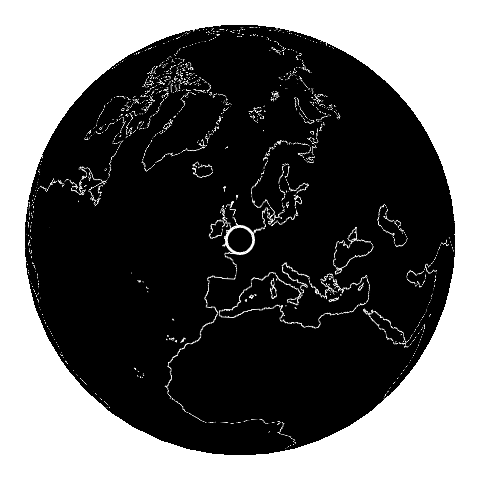

# REAPPEAR: The Map - 10⁷ metres

The Map is one of the five Network Scopes from [The Reappearing Computer](https://davidchatting.com/reappearingcomputer/), a research project about making computational work visible. This scope operates at the largest scale, the Earth itself, 10⁷ metres - it how the home creates work across the planet through its use of the Internet. The other scopes measure at different scales.

The Map runs on a Raspberry Pi as a display in your home and illustrates the network activity in real-time. It requires that [Pi-hole](https://pi-hole.net/), a network-wide DNS ad-blocker, is running on the local network.

## How work is mapped

1. A device on the network makes a [DNS request](https://en.wikipedia.org/wiki/Domain_Name_System), which is logged by Pi-hole.
2. The Map polls Pi-hole's API is for new hostnames roughly once a second.
3. New hostnames join a queue and are processed in turn.
4. Each hostname is resolved to an IP, then that IP is sent to [ipinfo.io](https://ipinfo.io/) for a rough lat/lon,
   cached to `data/location_cache.json`.
5. The globe animates to that location.

## Structure

- `source/` — the `.pde` sketch source
- `data/` — earth texture (attribution below) and the location cach
- `lib/` — third-party libraries, see Building below
- `TheMap` — launcher script
- `config.properties.example` — config template (copy to `config.properties` and fill in real values)

## Hardware / OS

- **Board:** Raspberry Pi 3 Model B Rev 1.2
- **OS:** Raspbian GNU/Linux 10 (buster), kernel `5.10.103-v7+` (armv7l)
- **Display:** [Pimoroni HyperPixel 2.1" Round](https://shop.pimoroni.com/en-us/products/hyperpixel-round) (`dtoverlay=hyperpixel2r` in `/boot/config.txt`)
- **Java:** OpenJDK 11.0.18 (Raspbian build)

## Building

1. Get `core.jar`, `jogl-all.jar`, `gluegen-rt.jar` and their `-natives-linux-armv6hf.jar`
   companions from `<processing-install>/core/library/` in a
   [Processing 3.5.4](https://github.com/processing/processing/releases/tag/processing-0270-3.5.4)
   install.
2. Get `Ani.jar` from the [Ani source](https://github.com/b-g/Ani).
3. Put all of the above in `lib/`.
4. `javac -cp lib/core.jar:lib/jogl-all.jar:lib/gluegen-rt.jar:lib/Ani.jar -d build_classes build/TheMap.java`,
   then package into `lib/TheMap.jar` with a manifest declaring `Main-Class: TheMap`.

## Font

Helvetica, loaded as an installed **system** font at runtime, not a bundled file. Falls back to Java's `SansSerif` if
Helvetica isn't installed.

## Running

Copy `config.properties.example` to `config.properties` (gitignored) and fill in three values,
then run `./TheMap`:

- `pihole.server` — host:port of the Pi-hole instance (e.g. `192.168.1.175:80`)
- `pihole.key` — Pi-hole admin/app password, see:
  [Pi-hole's v6 API](https://docs.pi-hole.net/api/)
- `ipinfo.token` — API token for [ipinfo.io](https://ipinfo.io/)

## Earth texture attribution

`data/eqcy_600.png` is derived from
[BlankMap-Equirectangular.svg](https://commons.wikimedia.org/wiki/File:BlankMap-Equirectangular.svg)
(Wikimedia Commons, [Natural Earth](https://www.naturalearthdata.com/) data,
[CC0 1.0](https://creativecommons.org/publicdomain/zero/1.0/)): rasterized, thresholded to a
binary land mask, then edge-detected down to just the coastline as a white line on black.
